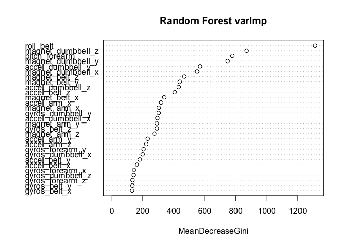
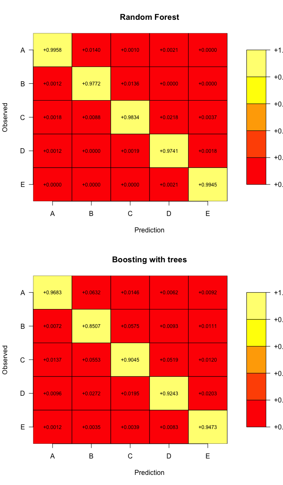
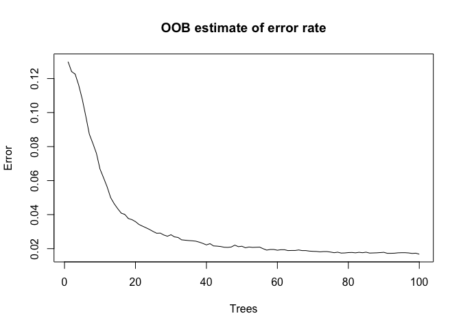

Course Project Practical Machine Learning
================
Oscar Nieto
02/19/2021

This report contains the procedure and the results requested for the
course project of the Practical Machine Learning class. This is part of
the Coursera specialization in Data Science offered by Johns Hopkins
University.

# Executive summary

The goal of this project is to present a model that is capable of
predicting the manner in which the subjects realized the exercise,
predicting the quality of execution *(“clasee” variable)*, with the data
provided by the measurements devices.

# Selection of the variables and data partition

Once the two datasets (train and test) are loaded in R and the
corresponding seed is defined, the train data is split in two parts, one
to apply the create the models *(70% of the data)* and the other to
validate them.

Then the predicting variables that are the best to predict the outcome
are selected. These variables correspond to the features described by
Velloso et al. (2013), where they found that features of roll,
accelerometer and magnetometer in the belt and the arm, the gyro and the
pitch in the forearm.

``` r
load(file = "projectData.RData")
colnames(trainCV)
```

    ##  [1] "classe"            "roll_belt"         "accel_belt_x"     
    ##  [4] "accel_belt_y"      "accel_belt_z"      "gyros_belt_x"     
    ##  [7] "gyros_belt_y"      "gyros_belt_z"      "magnet_belt_x"    
    ## [10] "magnet_belt_y"     "magnet_belt_z"     "accel_arm_x"      
    ## [13] "accel_arm_y"       "accel_arm_z"       "magnet_arm_x"     
    ## [16] "magnet_arm_y"      "magnet_arm_z"      "accel_dumbbell_x" 
    ## [19] "accel_dumbbell_y"  "accel_dumbbell_z"  "magnet_dumbbell_x"
    ## [22] "magnet_dumbbell_y" "magnet_dumbbell_z" "gyros_dumbbell_x" 
    ## [25] "gyros_dumbbell_y"  "gyros_dumbbell_z"  "pitch_forearm"    
    ## [28] "gyros_forearm_x"   "gyros_forearm_y"   "gyros_forearm_z"

With these variables two models are proposed and compared to evaluate
which have the best performance *(Accuracy)* with the train data. The
model that described the highest accuracy was used to the final
predictions.

# Fitted models and performance

The two tested models are based in random forests and the generalized
boosted regression with trees (gbm). Each of the tested models have an
approach that requires *resampling (Bootstrap)*, for these reason there
is no need to execute and external cross validation of the models.
However, to compare them a proper validation with the independent train
data is required.

``` r
#random forest
randomForest(classe~., data=trainCV, ntree=100) -> fit_rf
#boosting with trees (gbm)
train(classe~., data=trainCV, method="gbm", verbose=FALSE) -> fit_gbm
```

With the two models, it is important to see the relative importance of
all of the predictors within each model.

``` r
pks <- c("caret","gbm","randomForest") #load packages
lapply(pks, require, character.only = TRUE)
```

    ## [[1]]
    ## [1] TRUE
    ## 
    ## [[2]]
    ## [1] TRUE
    ## 
    ## [[3]]
    ## [1] TRUE

``` r
load(file = "projectData.RData")
varImpPlot(fit_rf, main="Random Forest varImp")
```

<!-- -->

``` r
varImp(fit_gbm)
```

    ## gbm variable importance
    ## 
    ##   only 20 most important variables shown (out of 29)
    ## 
    ##                   Overall
    ## roll_belt         100.000
    ## pitch_forearm      56.395
    ## magnet_dumbbell_z  42.190
    ## magnet_dumbbell_y  33.439
    ## magnet_belt_z      26.016
    ## accel_dumbbell_y   20.936
    ## accel_dumbbell_z   17.175
    ## magnet_dumbbell_x  12.525
    ## gyros_belt_z       12.170
    ## magnet_arm_z        9.950
    ## magnet_belt_x       9.424
    ## gyros_dumbbell_y    8.572
    ## magnet_arm_y        8.397
    ## accel_dumbbell_x    8.343
    ## accel_belt_z        7.889
    ## magnet_arm_x        6.089
    ## magnet_belt_y       5.867
    ## accel_arm_z         3.292
    ## accel_arm_x         3.288
    ## gyros_dumbbell_x    3.005

It can be seen that the *roll belt, the magnetometer and the
acceleration of the dumbbell and the pitch forearm* are the most
relevant predictors. Also these models were compared with the obtained
accuracy of the prediction with the validation data, that was
partitioned before.

``` r
predict(fit_rf, newdata=valCV) -> pred_rf
predict(fit_gbm, newdata=valCV) -> pred_gbm
```

    ##          [,1]                [,2]                 
    ##          "Random Forest"     "Boosting with trees"
    ## Accuracy "0.986236193712829" "0.923364485981308"

Also it is possible to generate a series of normalized confusion matrix
to visualize the performance of each model.

    ##        
    ## pred_rf    A    B    C    D    E
    ##       A 1667   16    1    2    0
    ##       B    2 1113   14    0    0
    ##       C    3   10 1009   21    4
    ##       D    2    0    2  939    2
    ##       E    0    0    0    2 1076

    ##         
    ## pred_gbm    A    B    C    D    E
    ##        A 1621   72   15    6   10
    ##        B   12  969   59    9   12
    ##        C   23   63  928   50   13
    ##        D   16   31   20  891   22
    ##        E    2    4    4    8 1025

<!-- -->

Also the change of the out of sample error of the random forest model
can be visualized with respect of the number of trees used to fit the
model. The obtained OOB estimate of error is very small, therefore this
random forest model will make good predictions with new data.

<!-- -->

With this evidence it is clear that the model that was obtained with
random forests has more accuracy and makes better predictions. So, this
model is used to predict the final 20 cases with the test dataset.

# Final prediction

With the random forest and the test dataset the final 20 cases were
predicted.

``` r
predict(fit_rf, newdata=TestHAR)
```

    ##  1  2  3  4  5  6  7  8  9 10 11 12 13 14 15 16 17 18 19 20 
    ##  B  A  B  A  A  E  D  B  A  A  B  C  B  A  E  E  A  B  B  B 
    ## Levels: A B C D E
